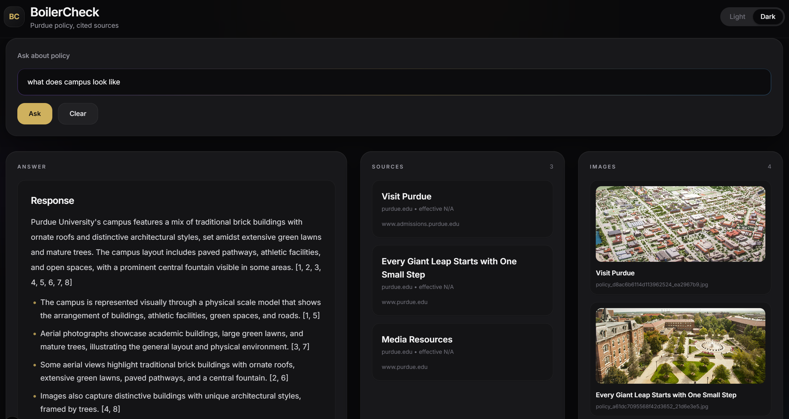

# BoilerCheck [boiler-check.vercel.app](https://boiler-check.vercel.app)




A Retrieval-Augmented Generation (RAG) web app for answering questions about
Purdue University policies, housing, dining, and academics. Ask a question in
plain English and get a concise, grounded answer with citations back to the
exact policy sections — plus any relevant images pulled from official Purdue
pages.

## Features

- Natural-language Q&A over Purdue policy text and images, grounded in retrieved sources.
- Streaming answer tokens (Server-Sent Events) so the UI feels responsive.
- Numbered `[1]`, `[2]` citations in the answer that map to clickable source cards.
- Image retrieval gated by a similarity threshold so irrelevant images are dropped.
- LLM-refusal detection in the frontend — if the model can't answer from the sources, the Sources / Images panels are hidden instead of showing noise.
- End-to-end pipeline from web scraping → Firestore → Pinecone → LLM, with each stage runnable independently.
- A retrieval benchmark (`benchmark/`) with 20 gold-standard queries used to choose the embedding model and evaluate rerankers.

## Architecture

```
                        ┌──────────────────────┐
Purdue websites ───►    │  scraper/crawler     │  ──► Firestore
                        │  (DFS crawl + image  │       ├── policies
                        │   download + Gemini  │       └── policies_with_images
                        │   classification)    │
                        └──────────────────────┘
                                   │
                                   ▼
                        ┌──────────────────────┐
                        │  backend/ingest_*.py │
                        │  (MiniLM embeddings) │  ──► Pinecone (384-dim, cosine)
                        └──────────────────────┘
                                   │
                                   ▼
User question
     │
     ▼
[Next.js frontend]  ──►  POST /ask/stream  ──►  [FastAPI backend]
     ▲                                                  │
     │                                                  ├─ 1. Embed query (MiniLM-L6-v2, 384-dim)
     │                                                  ├─ 2. Pinecone similarity search (top-K)
     │                                                  ├─ 3. Split text vs. image chunks
     │                                                  │     (images gated by IMAGE_SCORE_THRESHOLD)
     │                                                  ├─ 4. Generate answer (Gemini 2.5 Flash Lite,
     │                                                  │     streamed token-by-token via SSE)
     │◄─ stream: documents → tokens → done ─────────────┘
```

At query time the backend hits Pinecone only — Firestore is not in the hot
path. Ingest is a separate offline step.

### Why no reranker?

The benchmark (see `benchmark/README.md`) showed the plain MiniLM cosine
retrieval already achieved 90% hit rate and 0.875 MRR@4, and the
cross-encoder reranker gave **0%** net improvement on our 20-query eval set.
RankLLM (Gemini-based) hit 100% but added ~6.5 s per query, which isn't worth
it for a responsive UI. So the live pipeline has no reranker.

## Project structure

```
BoilerCheck/
├── .env                                            API keys (not committed)
├── gdg-web-scraping-data-firebase-adminsdk-*.json  Firebase service-account key (not committed)
├── requirements.txt                                Consolidated Python deps
├── Dockerfile                                      Container build for the FastAPI backend
├── package.json                                    Next.js / React frontend
│
├── src/app/
│   ├── page.js                 Main UI — search, streaming answer, source/image cards
│   ├── layout.js               Root layout
│   └── globals.css             Global styles
│
├── backend/
│   ├── main.py                 FastAPI server — POST /ask and POST /ask/stream (SSE)
│   ├── rag.py                  Full RAG pipeline (embed → retrieve → LLM, streaming)
│   ├── ingest_with_images.py   Embed & upsert text + image-description chunks → Pinecone
│   ├── ingest_policies_no_images.py  Same thing but text-only (for the `policies` collection)
│   ├── ingest_mock_data.py     Seed Pinecone from data/rag_mock_data.json (dev/test)
│   └── clear_pinecone.py       Wipe the configured Pinecone index
│
├── scraper/
│   ├── crawler/
│   │   ├── dynamic_crawlerV2.py   Main DFS crawler — scrapes text + images, uploads to Firestore
│   │   ├── scrape_single.py       Text-only scrape + chunk of one URL → `policies` collection
│   │   ├── classify_images.py     Calls Gemini to classify + describe each downloaded image
│   │   └── check_models.py        Utility to list available Gemini models
│   ├── scrape/
│   │   └── scrape_3.py            Single-page text extraction helper used by the crawler
│   ├── firebase/
│   │   ├── firebase_write.py          Firestore client + upload helpers for both collections
│   │   ├── clean_error_images.py      Removes images with `image_type == "error"`
│   │   └── clean_short_sections.py    Removes sections whose text is < 10 words
│   ├── testing/                Hand-rolled upload/verification utilities
│   └── data/                   Scraped JSON artifacts (gitignored)
│
├── benchmark/
│   ├── runner.py               Runs embedder × reranker sweeps
│   ├── embedders.py            Pluggable embedding-model wrappers
│   ├── rerankers.py            Cross-encoder, Cohere, RankLLM wrappers
│   ├── metrics.py              Hit rate / MRR / NDCG / context precision
│   ├── eval_set.json           20-query gold-standard set
│   ├── build_eval_set.py       Helper to regenerate the eval set
│   ├── analyze_results.py      Pretty-print ranked comparison
│   └── results/                Benchmark outputs
│
├── data/
│   └── rag_mock_data.json      Legacy mock data (only used by ingest_mock_data.py)
│
└── public/                     Static assets for the Next.js frontend
```

## Prerequisites

- Python 3.11+
- Node.js 18+
- A [Pinecone](https://app.pinecone.io) account (free Starter tier works)
- A [Gemini API key](https://aistudio.google.com/app/apikey) (free tier works)
- A Firebase Admin SDK service-account JSON key for your Firestore project

## Setup

### 1. Install frontend dependencies

```powershell
cd BoilerCheck
npm install
```

### 2. Set up the Python backend

```powershell
# from BoilerCheck/
python -m venv .venv
.venv\Scripts\Activate.ps1
pip install -r requirements.txt
```

The root `requirements.txt` covers everything — the `backend/requirements.txt`
and `scraper/requirements.txt` files just forward to it.

### 3. Configure environment variables

Create `BoilerCheck/.env` (repo root — every script loads it from here):

```env
GEMINI_API_KEY=your_gemini_api_key_here

PINECONE_API_KEY=your_pinecone_api_key_here
PINECONE_INDEX_NAME=your_pinecone_index_name_here

# Optional retrieval tuning
IMAGE_SCORE_THRESHOLD=0.35   # Min cosine score for an image to be returned
IMAGE_TOP_K=4                # Max images per query
RAG_RETRIEVE_K=8             # Candidates pulled from Pinecone

# Optional: which Firestore collection ingest_with_images reads from
POLICIES_COLLECTION=policies_with_images

# Optional: comma-separated allowed origins for CORS
CORS_ORIGINS=http://localhost:3000,https://boiler-check.vercel.app
```

Create your Pinecone index with:

- **Dimensions:** `384`
- **Metric:** `cosine`
- **Type:** Serverless (AWS us-east-1)

### 4. Add the Firebase service-account key

Download a Firebase Admin SDK JSON key (Firebase Console → Project settings →
Service accounts → Generate new private key) and drop it in the **BoilerCheck
repo root** with its original filename (e.g.
`gdg-web-scraping-data-firebase-adminsdk-fbsvc-d6a5997024.json`).

All ingest and scraper scripts load it from this hardcoded location.
`.gitignore` already excludes `*firebase-adminsdk*.json`.

### 5. Ingest policy data into Pinecone

Pick the pipeline that matches your Firestore collection:

```powershell
# from BoilerCheck/backend/ with .venv active

# Text + image-description chunks (from policies_with_images)
python ingest_with_images.py

# Text-only chunks (from the `policies` collection)
python ingest_policies_no_images.py
```

Both scripts are idempotent over document IDs — re-run them whenever
Firestore changes.

### 6. Run the app locally

Open two terminals:

```powershell
# Terminal 1 — backend (from BoilerCheck/backend/ with .venv active)
python main.py
# ─► FastAPI on http://127.0.0.1:8000

# Terminal 2 — frontend (from BoilerCheck/)
npm run dev
# ─► Next.js on http://localhost:3000
```

## API

The backend exposes two endpoints. Both accept `{"query": "..."}`:

| Method | Path            | Returns                                                                |
|--------|-----------------|------------------------------------------------------------------------|
| POST   | `/ask`          | `{"answer": "...", "documents": [...]}` (blocking, full response)      |
| POST   | `/ask/stream`   | SSE stream: `documents` event, many `token` events, then `done`        |

The frontend uses `/ask/stream` so answer text streams in while the source
cards are rendered immediately.

## Data ingestion pipeline

### Scraping new pages

```powershell
# from BoilerCheck/scraper/crawler/ with .venv active

# Full crawl — follows links up to MAX_LINKS, downloads + classifies images,
# uploads text & image metadata to Firestore's policies_with_images collection
python dynamic_crawlerV2.py https://www.purdue.edu/policies/ 120

# Text-only scrape of a single page (writes to the `policies` collection)
python scrape_single.py https://www.purdue.edu/some/page
```

The crawler:

1. DFS-traverses links on any `*.purdue.edu` subdomain.
2. For each page, uses `scrape/scrape_3.py` to extract structured sections.
3. Downloads every `` (skipping 0×0 SVG placeholders), hashes for dedup.
4. Classifies each image via Gemini (`classify_images.py`) — gets a type
   (`photo`, `floor_plan`, `diagram`, ...) and a natural-language description.
5. Writes the combined record to Firestore.

Multiple crawler instances with different starter URLs can run in parallel —
they each keep an in-memory dedup set and Firestore writes are keyed by
document ID.

### Cleaning up Firestore

```powershell
# from BoilerCheck/scraper/firebase/ with .venv active

# Remove images that came back with image_type == "error"
python clean_error_images.py

# Remove any section whose text has fewer than 10 words
python clean_short_sections.py
```

After cleanup, re-run the appropriate `ingest_*.py` to refresh Pinecone.

### Local image cache

Images downloaded during a crawl go to `scraper/crawler/data/images/` and are
**gitignored**. They're only used during the crawl for hashing and Gemini
classification — the descriptions and metadata live in Firestore afterwards,
so this directory is safe to delete at any time.

## Firestore record schema

Each document in `policies_with_images` follows this shape:

```json
{
  "document_id": "policy_...",
  "title": "Optional document title",
  "domain": "purdue.edu",
  "url": "https://www.purdue.edu/...",
  "effective_date": "YYYY-MM-DD",
  "has_structure": true,
  "score": 53,
  "relevant": true,
  "images": [
    {
      "description": "Text used for image retrieval",
      "source_url": "https://...",
      "filename": "...",
      "format": "jpg",
      "image_type": "photo",
      "md5": "...",
      "width": 3527,
      "height": 2351,
      "public_url": ""
    }
  ],
  "sections": [
    {
      "section_title": "Section Name",
      "text": "The policy text that gets embedded and retrieved."
    }
  ]
}
```

Image descriptions and section text are embedded as separate Pinecone
entries. At query time, images are only returned if their similarity score
meets `IMAGE_SCORE_THRESHOLD`.

Documents in the plain `policies` collection share the same shape minus the
`images` array.

## Deployment

- **Frontend:** deployed on Vercel (`boiler-check.vercel.app`). `NEXT_PUBLIC_API_URL` points at the backend.
- **Backend:** the included `Dockerfile` builds a container running `uvicorn main:app`. Set `GEMINI_API_KEY`, `PINECONE_API_KEY`, `PINECONE_INDEX_NAME`, and `CORS_ORIGINS` as env vars on the host.

## Benchmark

See [`benchmark/README.md`](benchmark/README.md) for the full embedder × reranker
sweep. Short version: **MiniLM-L6-v2 with no reranker** is the best
accuracy/latency trade-off on this dataset, and that's what the live app uses.
